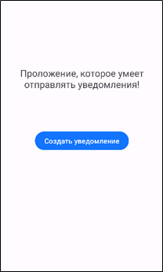
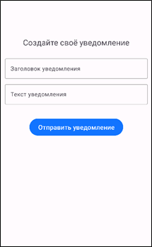
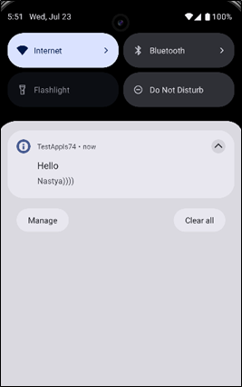

# NotificationSender
Приложение для отправки и обработки уведомлений.

## Описание
Мобильное приложение реализовано на Kotlin для Android (минимум Android 8.0). Приложение интегрировано с Firebase Cloud Messaging и обеспечивает автоматическую регистрацию устройства, получение и обновление FCM-токена и обработку входящих push-уведомлений. В приложении реализована кастомная обработка notification- и data-сообщений с использованием FirebaseMessagingService, включая логирование всех этапов доставки и отображения уведомлений. Система уведомлений поддерживает современные возможности Android, такие как каналы уведомлений, группировка сообщений и настройка приоритетов.

Серверная часть реализована на Node.js с использованием Firebase Admin SDK. Сервер обеспечивает регистрацию устройств, отправку стандартных и кастомных push-уведомлений и сбор статистики доставки. Для хранения данных используется база SQLite, в которой сохраняются FCM-токены устройств и подробная информация обо всех отправленных уведомлениях.

## 📸 Скриншоты
 \
Скриншот главной страницы приложения

 \
Скриншот страницы создания уведомления

 \
Скриншот полученного уведомления